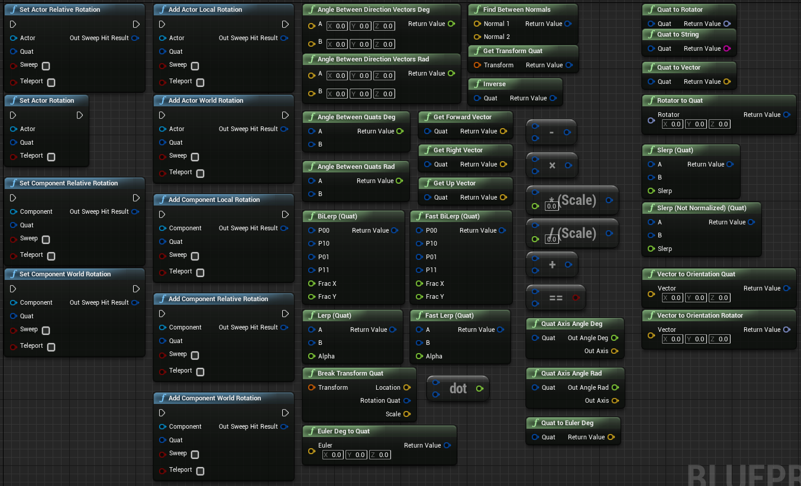

BlueprintRotationLibrary
========================

A collection of blueprint nodes to work with Quaternions within Unreal Engine's Blueprint scripting

Just copy the whole folder into your **EnginePath**\Engine\Plugins, or **ProjectPath**\Plugins if you prefer. 

It's enabled by default, you can of course disable it in the BlueprintQuaternionLibrary.uplugin or in your project plugin settings.

I don't care what you do with this, I put this into the public domain. It's mostly just wrappers around FQuat functions
anyway. <3

This project lives on GitLab (https://gitlab.com/CraftedCart/BlueprintRotationLibrary), however changes are synced over
to GitHub (https://github.com/CraftedCart/BlueprintRotationLibrary)
